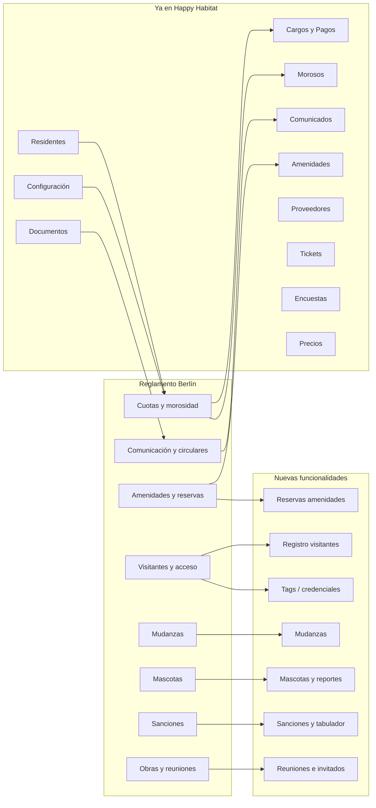

# Análisis Reglamento Berlín vs Sistema de Administración Happy Habitat

Documento base: **REGLAMENTO VIVIENDA (BERLIN)_240422_122755 (Original).pdf** (Condominio Berlín, Capital Sur, Querétaro).  
Objetivo: identificar qué aspectos del reglamento se pueden **administrar** o **automatizar** en el sistema actual y qué implicaría implementarlos.

---

## 1. Resumen del reglamento (temas clave)

- **Definiciones**: Administrador, Mesa Directiva, Condómino, Causahabiente, **Moroso** (2+ cuotas ordinarias o 1 extraordinaria no pagada en plazo), cuotas condominales, amenidades.
- **Áreas comunes y amenidades**: Horarios (ej. 08:00–22:00); alberca, terraza, área de juegos con horarios propios. **Reserva de terraza**: solicitud 15 días antes, depósito $1,000, cuota limpieza $500, máx 35 personas; uso condicionado a estar al corriente.
- **Visitantes y acceso**: Registro de visitas (nombre, placas, color, marca, hora entrada/salida, número de casa, credencial). Distintivos: amarillo visitantes, rojo proveedores, morado ventas. Tags/candados para condóminos (renovación bimestral según pago).
- **Vehículos**: Estacionamiento visitas vs condóminos; **mudanzas** con aviso 48 h y horarios (lun–vie 09–18, sáb 09–13).
- **Mascotas**: Máx 2 (perros pequeños o gatos), registro, placa; 3 reportes → retiro; expediente por animal.
- **Sanciones**: Fijadas por Mesa Directiva, cargadas por Administrador; pena convencional = 1 cuota ordinaria mensual hasta cumplir; tabuladores.
- **Comunicación**: Días de recolección de basura; avisos por circulares electrónicas o tablero; notificaciones al domicilio o medio electrónico.
- **Obras/reuniones**: Obras en unidad 09:00–19:00; reuniones con aviso 24 h y lista de invitados.
- **Otros**: Contratos de arrendamiento y gravámenes notificados al Administrador; registro de propietarios y representantes.

---

## 2. Mapeo: Reglamento → Happy Habitat

### 2.1 Ya cubierto en el sistema

| Aspecto reglamento                      | En Happy Habitat                              | Dónde                                                                                                                                                                                   |
| --------------------------------------- | --------------------------------------------- | --------------------------------------------------------------------------------------------------------------------------------------------------------------------------------------- |
| **Cuotas / mantenimiento**              | Cargos a residentes, pagos, historial         | admincompany-routes: `cargos-residente`, `pagos-residente`, `historial-pagos-residente/:residentId` |
| **Morosidad (definición)**              | Umbral configurable (ej. 2× mantenimiento)    | CommunityConfigurationBase.json: `MONTO_MANT`, `DIAS_TOL`; reporte Morosos                |
| **Reporte de morosos**                  | Listado de morosos                            | Ruta `reportes/morosos` → `MorososListComponent`                                                                                                                                        |
| **Comunicados / circulares**            | CRUD de comunicados                           | `comunicados`, ComunicadoForm, ComunicadoDetail                                                                                                                                         |
| **Amenidades (catálogo)**               | CRUD de amenidades                            | `amenidades`, AmenidadForm, AmenidadDetail                                                                                                                                              |
| **Registro de residentes/propietarios** | Residentes, detalle, edición                  | `residentes`, ResidenteForm, ResidentInfoDetail                                                                                                                                         |
| **Documentos**                          | CRUD documentos (reglamento, actas, etc.)     | `documentos`, DocumentoForm, DocumentDetail                                                                                                                                             |
| **Configuración de comunidad**          | Parámetros (contacto, banco, días pago, etc.) | `configuracion`, ConfiguracionesComponent; seed con DIA_PAGO, DIAS_TOL, MONTO_MANT                                                                                                      |
| **Proveedores**                         | Catálogo y detalle                            | `proveedores`, ProveedorForm, ProveedorDetail                                                                                                                                           |
| **Tickets / reportes de incidentes**    | Tickets por residente                         | `residentes/tickets`, TicketForm, TicketDetail                                                                                                                                          |
| **Encuestas**                           | CRUD encuestas                                | `encuestas`, EncuestaForm, EncuestaDetail                                                                                                                                               |
| **Precios**                             | Módulo precios                                | `precios`, PrecioForm, PrecioDetail                                                                                                                                                     |

### 2.2 Administrable o automatizable como nuevas funcionalidades

| Aspecto reglamento                            | Qué administrar/automatizar                                                                                   | Tipo                                                                                                                                                         |
| --------------------------------------------- | ------------------------------------------------------------------------------------------------------------- | ------------------------------------------------------------------------------------------------------------------------------------------------------------ |
| **Reservas de amenidades (ej. terraza)**      | Solicitud 15 días antes, depósito, cuota limpieza, aforo; condicionar a estar al corriente                    | **Nuevo**: reservas de amenidades con reglas por amenidad (plazo mínimo, depósito, monto limpieza, máx personas), validación de morosidad antes de confirmar |
| **Registro de visitantes**                    | Nombre, placas, color, marca, hora entrada/salida, casa, credencial; distintivos (visitante/proveedor/ventas) | **Nuevo**: módulo visitas (registro entrada/salida, filtros por casa/fecha, opcional integración con acceso)                                                 |
| **Tags/candados condóminos**                  | Renovación bimestral según pago al corriente                                                                  | **Nuevo**: entidad "accesos/credenciales" por residente, estado (activo/suspendido), renovación ligada a pagos o a configuración (bimestral)                 |
| **Mudanzas**                                  | Aviso 48 h, horarios (lun–vie 09–18, sáb 09–13)                                                               | **Nuevo**: solicitudes de mudanza (fecha, horario, unidad), aprobación, recordatorios; reglas de horario configurables por comunidad                         |
| **Mascotas**                                  | Registro, placa, máx 2; 3 reportes → retiro; expediente por animal                                            | **Nuevo**: registro de mascotas por unidad (tipo, placa), incidencias/reportes; regla "3 reportes → retiro" y expediente descargable o visible               |
| **Sanciones**                                 | Tabulador, pena convencional (1 cuota mensual hasta cumplir), cargo al condómino                              | **Nuevo**: catálogo de sanciones (concepto, monto o "1 cuota"), aplicación a residente como cargo o concepto especial; reporte de sanciones                  |
| **Días de recolección de basura**             | Comunicar días y eventuales cambios                                                                           | **Parcial**: se puede usar **Comunicados**; opcional: configuración fija por comunidad (ej. "Lun/Mié/Vie") y mostrarla en app residente                      |
| **Obras en unidad**                           | Horario 09:00–19:00; avisos                                                                                   | **Parcial**: comunicados + opcional "solicitud de obra" con fecha y aprobación                                                                               |
| **Reuniones (lista invitados, aviso 24 h)**   | Registro de reuniones y lista de invitados                                                                    | **Nuevo**: solicitudes de reunión (fecha, unidad, lista invitados), aprobación; o al menos comunicado + documento adjunto                                    |
| **Contratos de arrendamiento / gravámenes**   | Notificación al Administrador                                                                                 | **Parcial**: en **Residente** o **Documentos**: tipo "contrato arrendamiento" / "gravamen"; flujo de "notificación" (registro de recepción)                  |
| **Notificaciones al domicilio o electrónico** | Medio preferido y envío                                                                                       | **Parcial**: si ya hay email/teléfono en residente, comunicados pueden enviarse por email; ampliable a "medio preferido" y bitácora de envíos                |

---

## 3. Diagrama de cobertura

---

## 4. Fases sugeridas de implementación

- **Fase 1 (corto plazo)**  
  - **Sanciones**: tabulador + aplicar como cargo al residente (aprovecha cargos/pagos existentes).  
  - **Reservas de amenidades**: solicitud, depósito y cuota limpieza; validación "al corriente" antes de confirmar.
- **Fase 2 (medio plazo)**  
  - **Registro de visitantes** (entrada/salida, placas, casa).  
  - **Mudanzas**: solicitud, ventana de horarios y aprobación.
- **Fase 3 (más adelante)**  
  - **Mascotas**: registro por unidad, incidencias y regla de 3 reportes.  
  - **Tags/credenciales**: vinculación a estado de pagos y renovación bimestral.  
  - **Reuniones**: solicitud + lista de invitados y aprobación.

Opcional en cualquier fase: ampliar **Documentos** o **Residentes** para contratos de arrendamiento y gravámenes, y **Configuración** para días de recolección de basura y horarios de obras.

---

## 5. Conclusión

- **Cubierto por el sistema actual**: cuotas, morosidad (con umbral configurable), comunicados, amenidades (catálogo), residentes, documentos, configuración, proveedores, tickets, encuestas, precios.  
- **Próximos pasos con mayor impacto según el reglamento**: **sanciones** (tabulador + cargo), **reservas de amenidades** (con reglas y validación de morosidad), **registro de visitantes** y **mudanzas**.  
- **Complementos**: mascotas con expediente e incidencias, tags/credenciales ligados a pagos, reuniones con invitados; y uso de comunicados/config para basura, obras y notificaciones.

Este plan se puede usar como backlog: priorizar por comunidad (Berlín u otras) y por esfuerzo (ej. sanciones y reservas primero).
